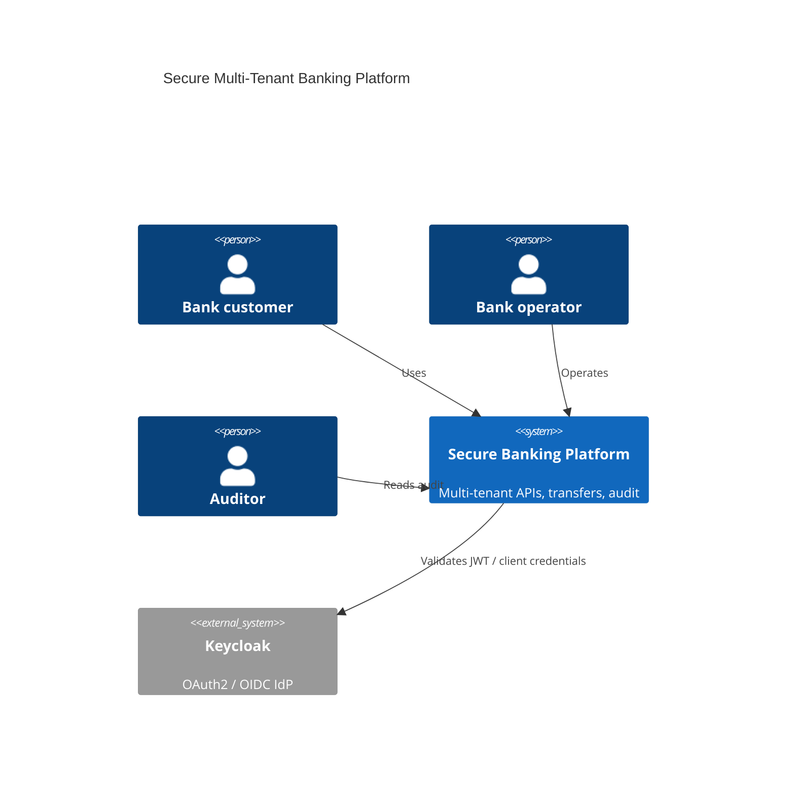
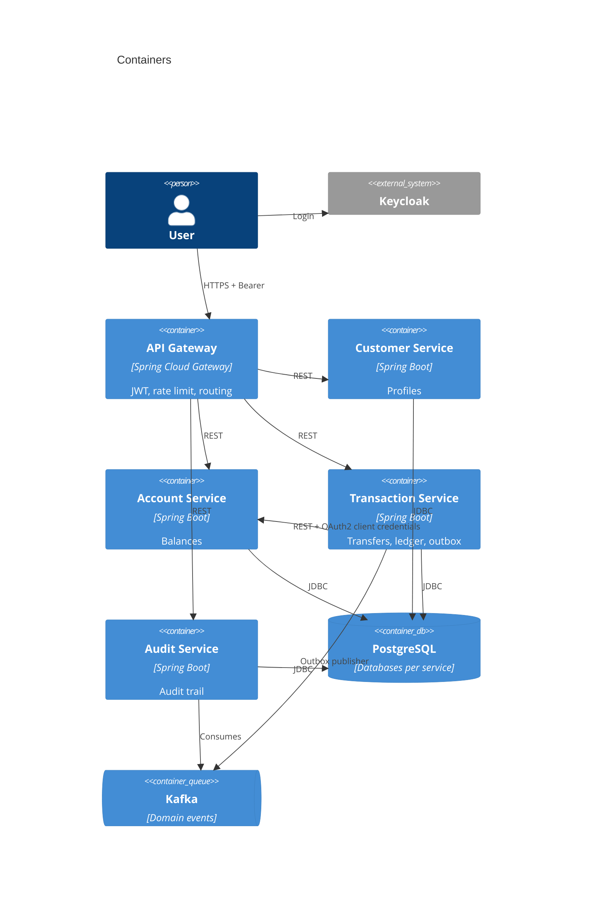
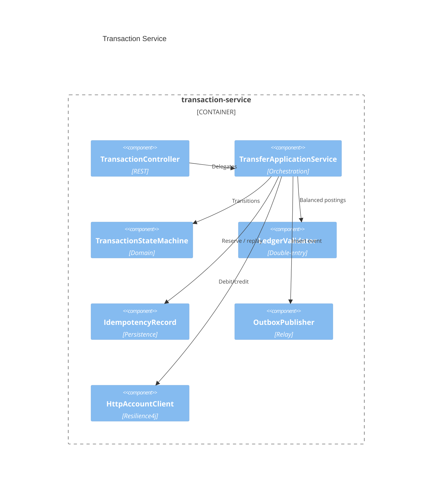

# C4

## Level 1 — System context

```mermaid
C4Context
    title Secure Multi-Tenant Banking Platform
    Person(customer, "Bank customer")
    Person(operator, "Bank operator")
    Person(auditor, "Auditor")
    System(platform, "Secure Banking Platform", "Multi-tenant APIs, transfers, audit")
    System_Ext(idp, "Keycloak", "OAuth2 / OIDC IdP")
    Rel(customer, platform, "Uses")
    Rel(operator, platform, "Operates")
    Rel(auditor, platform, "Reads audit")
    Rel(platform, idp, "Validates JWT / client credentials")
```

## Level 2 — Containers

```mermaid
C4Container
    title Containers
    Person(user, "User")
    System_Ext(idp, "Keycloak")
    Container(gw, "API Gateway", "Spring Cloud Gateway", "JWT, rate limit, routing")
    Container(cs, "Customer Service", "Spring Boot", "Profiles")
    Container(as, "Account Service", "Spring Boot", "Balances")
    Container(ts, "Transaction Service", "Spring Boot", "Transfers, ledger, outbox")
    Container(au, "Audit Service", "Spring Boot", "Audit trail")
    ContainerDb(pg, "PostgreSQL", "Databases per service")
    ContainerQueue(kafka, "Kafka", "Domain events")
    Rel(user, idp, "Login")
    Rel(user, gw, "HTTPS + Bearer")
    Rel(gw, cs, "REST")
    Rel(gw, as, "REST")
    Rel(gw, ts, "REST")
    Rel(gw, au, "REST")
    Rel(ts, as, "REST + OAuth2 client credentials")
    Rel(ts, kafka, "Outbox publisher")
    Rel(au, kafka, "Consumes")
    Rel(cs, pg, "JDBC")
    Rel(as, pg, "JDBC")
    Rel(ts, pg, "JDBC")
    Rel(au, pg, "JDBC")
```

## Level 3 — Transaction service components

```mermaid
C4Component
    title Transaction Service
    Container_Boundary(ts, "transaction-service") {
        Component(api, "TransactionController", "REST")
        Component(app, "TransferApplicationService", "Orchestration")
        Component(sm, "TransactionStateMachine", "Domain")
        Component(ledger, "LedgerValidator", "Double-entry")
        Component(idemp, "IdempotencyRecord", "Persistence")
        Component(outbox, "OutboxPublisher", "Relay")
        Component(client, "HttpAccountClient", "Resilience4j")
    }
    Rel(api, app, "Delegates")
    Rel(app, sm, "Transitions")
    Rel(app, ledger, "Balanced postings")
    Rel(app, idemp, "Reserve / replay")
    Rel(app, client, "Debit/credit")
    Rel(app, outbox, "Insert event")
```
