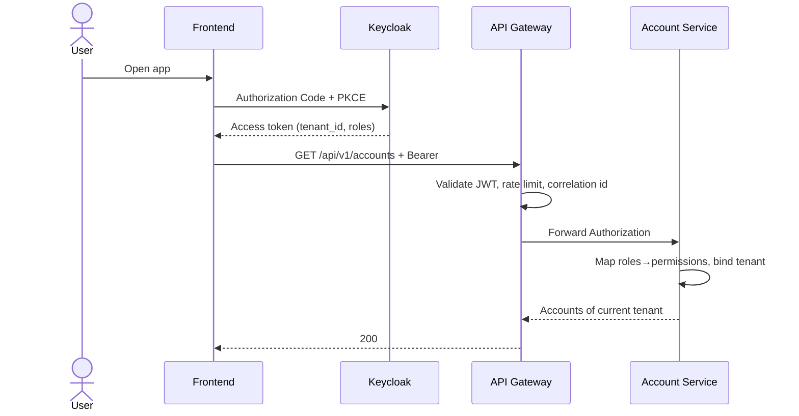
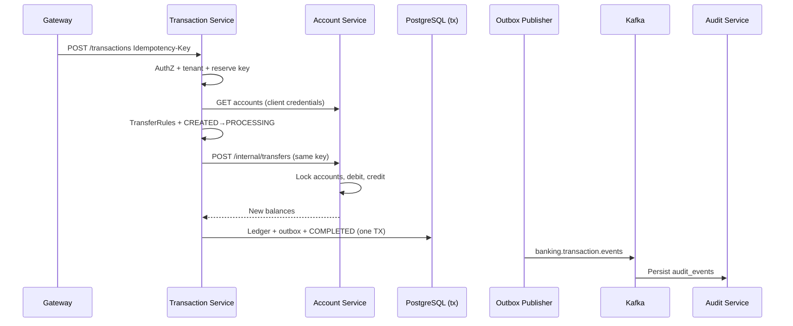
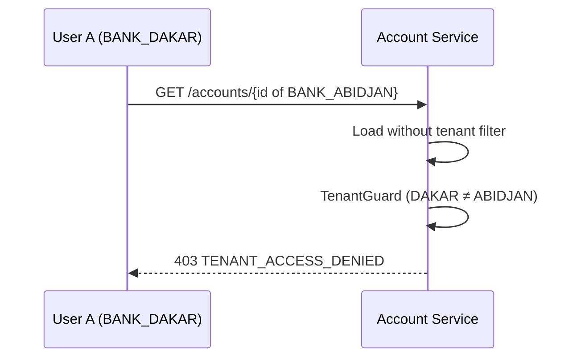
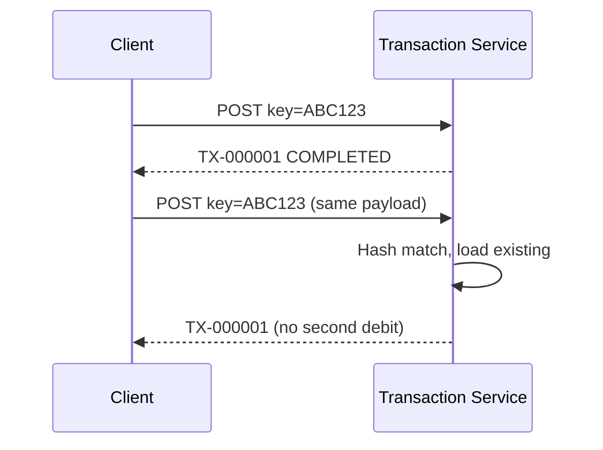

# Sequence diagrams

## Login and protected API

```mermaid
sequenceDiagram
    actor User
    participant FE as Frontend
    participant KC as Keycloak
    participant GW as API Gateway
    participant ACC as Account Service
    User->>FE: Open app
    FE->>KC: Authorization Code + PKCE
    KC-->>FE: Access token (tenant_id, roles)
    FE->>GW: GET /api/v1/accounts + Bearer
    GW->>GW: Validate JWT, rate limit, correlation id
    GW->>ACC: Forward Authorization
    ACC->>ACC: Map roles→permissions, bind tenant
    ACC-->>GW: Accounts of current tenant
    GW-->>FE: 200
```

## Transfer

```mermaid
sequenceDiagram
    participant GW as Gateway
    participant TX as Transaction Service
    participant ACC as Account Service
    participant DB as PostgreSQL (tx)
    participant OB as Outbox Publisher
    participant K as Kafka
    participant AU as Audit Service
    GW->>TX: POST /transactions Idempotency-Key
    TX->>TX: AuthZ + tenant + reserve key
    TX->>ACC: GET accounts (client credentials)
    TX->>TX: TransferRules + CREATED→PROCESSING
    TX->>ACC: POST /internal/transfers (same key)
    ACC->>ACC: Lock accounts, debit, credit
    ACC-->>TX: New balances
    TX->>DB: Ledger + outbox + COMPLETED (one TX)
    OB->>K: banking.transaction.events
    K->>AU: Persist audit_events
```

## Cross-tenant denial

```mermaid
sequenceDiagram
    participant UserA as User A (BANK_DAKAR)
    participant ACC as Account Service
    UserA->>ACC: GET /accounts/{id of BANK_ABIDJAN}
    ACC->>ACC: Load without tenant filter
    ACC->>ACC: TenantGuard (DAKAR ≠ ABIDJAN)
    ACC-->>UserA: 403 TENANT_ACCESS_DENIED
```

## Idempotent replay

```mermaid
sequenceDiagram
    participant C as Client
    participant TX as Transaction Service
    C->>TX: POST key=ABC123
    TX-->>C: TX-000001 COMPLETED
    C->>TX: POST key=ABC123 (same payload)
    TX->>TX: Hash match, load existing
    TX-->>C: TX-000001 (no second debit)
```
